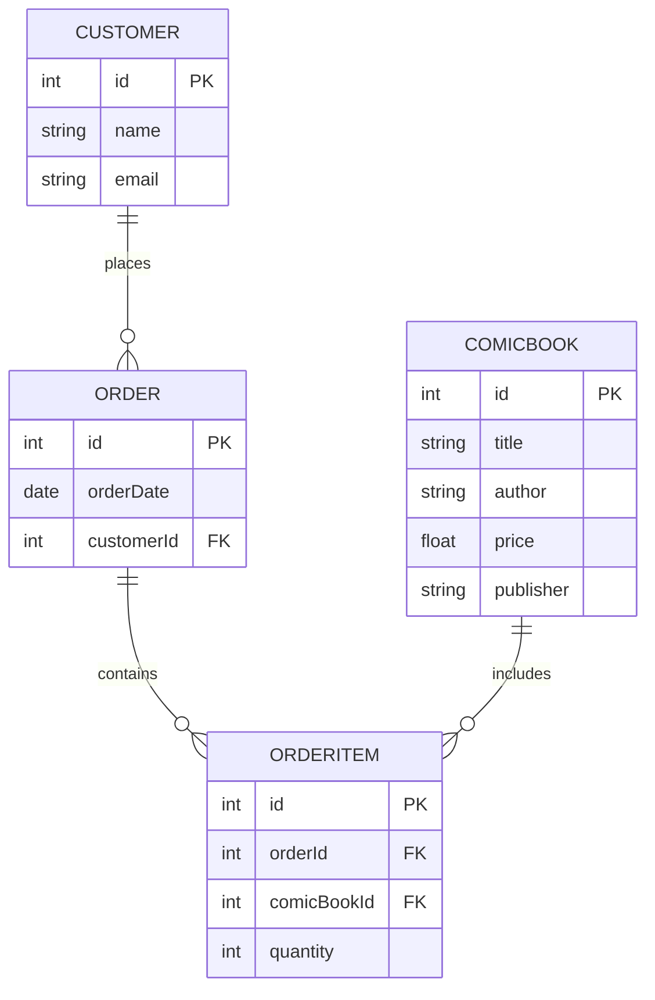
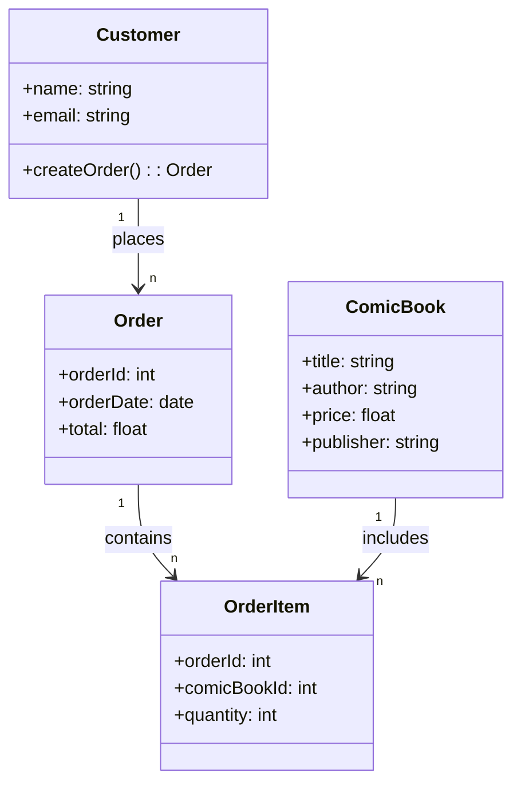
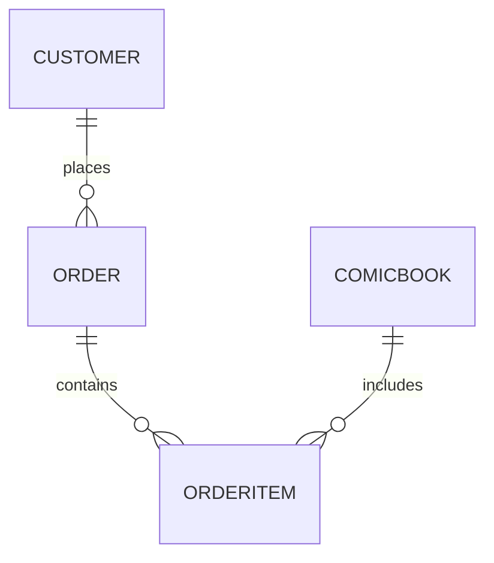

# Comic Book Store

## Introduction

This is a personal comic book store app being built currently as a training exercise.

## Purpose

The purpose of this site will be to sell my comic books for lots of money and fund the rest of my life. Or, at least, a nice dinner.

## Features

### Must Have

- A person must be able to add a comic book to the cart.
- A person must be able to purchase a comic book.
  ...

### Should Have

- A person should be able to sign in.
- A person should be able to see details about the comic book they are purchasing.
  ...

### Could Have

- The site could have individual comic book pages that show the details of the book.
- The site could have an admin section where someone could manage customers, orders, and comic book data.
  ...

### Won't Have

- The site will not have a way for customers to contact customer service.
- The site will not have a way for customers to comment on what they think about a particular book.
  ...

## Comic Book Store ERD

## Comic Book Store Domain Diagram

## Alternative Comic Book Store Domain Diagram

