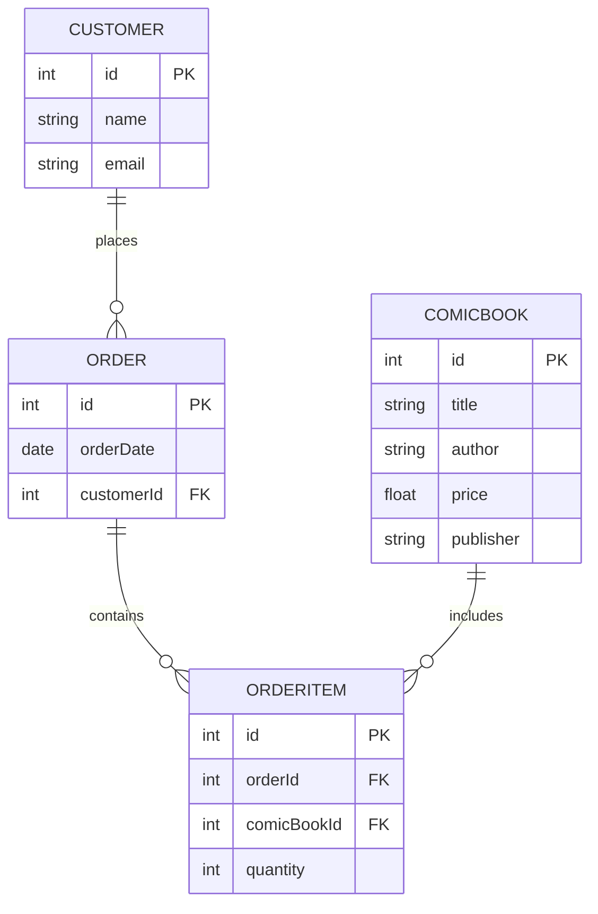
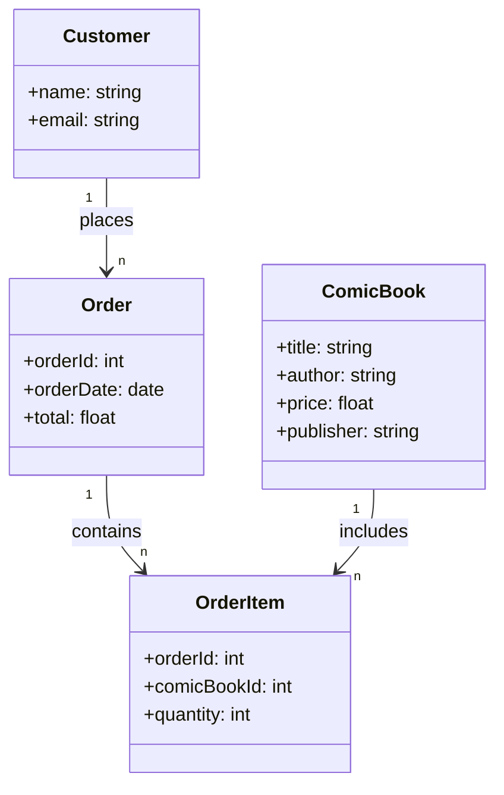
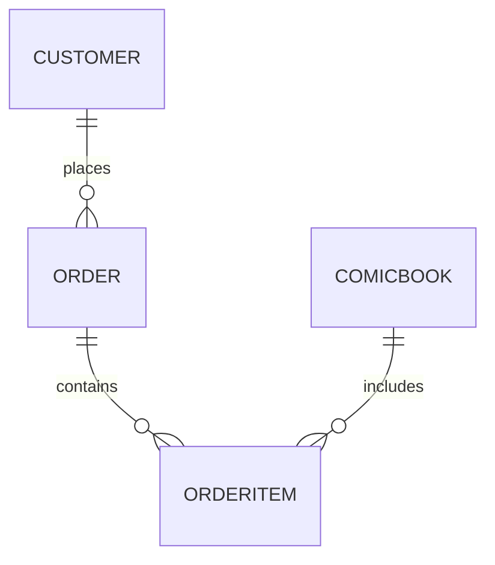

## Comic Book Store ERD

```mermaid
erDiagram
    CUSTOMER {
        int id PK
        string name
        string email
    }
    COMICBOOK {
        int id PK
        string title
        string author
        float price
        string publisher
    }
    ORDER {
        int id PK
        date orderDate
        int customerId FK
    }
    ORDERITEM {
        int id PK
        int orderId FK
        int comicBookId FK
        int quantity
    }
    CUSTOMER ||--o{ ORDER : places
    ORDER ||--o{ ORDERITEM : contains
    COMICBOOK ||--o{ ORDERITEM : includes
```

## Comic Book Store Domain Diagram

```mermaid
classDiagram
    class Customer {
        +name: string
        +email: string
    }

    class ComicBook {
        +title: string
        +author: string
        +price: float
        +publisher: string
    }

    class Order {
        +orderId: int
        +orderDate: date
        +total: float
    }

    class OrderItem {
        +orderId: int
        +comicBookId: int
        +quantity: int
    }

    Customer "1" --> "n" Order : places
    Order "1" --> "n" OrderItem : contains
    ComicBook "1" --> "n" OrderItem : includes
```

## Alternative Comic Book Store Domain Diagram

```mermaid
erDiagram
    CUSTOMER ||--o{ ORDER : places
    ORDER ||--o{ ORDERITEM : contains
    COMICBOOK ||--o{ ORDERITEM : includes
```
